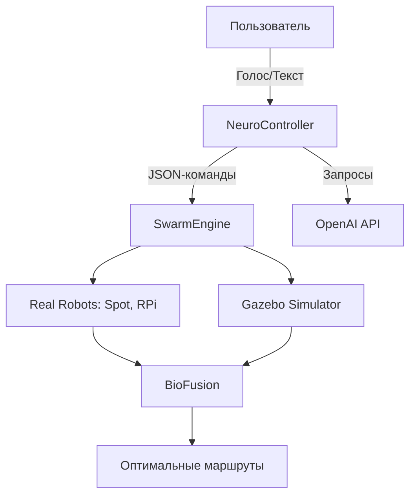

### **NeuroSwarm OS (NS-OS) – Полная документация**  
**Универсальная ОС для роботов с поддержкой OpenAI, роевого ИИ и биомиметики**  

---

## **1. Архитектура**  


---

## **2. Ключевые компоненты**

### **A. NeuroController (LLM-ядро)**  
**Интеграция OpenAI и локальных моделей:**  
```python
# core/neuro_controller/llm_bridge.py
import openai
from ollama import generate

class LLMController:
    def __init__(self):
        self.openai_key = "your-api-key"
        self.local_model = "quantized_mistral"  # Для RPi

    def process_command(self, text):
        if is_complex_task(text):  # Сложные задачи -> OpenAI
            response = openai.ChatCompletion.create(
                model="gpt-4o",
                messages=[{"role": "user", "content": f"Как роботу выполнить: {text}?"}]
            )
            return response.choices[0].message.content
        else:  # Простые задачи -> локальная Mistral
            return generate(model=self.local_model, prompt=text)
```

### **B. SwarmEngine (Роевое управление)**  
**Гибридный режим (реальные роботы + Gazebo):**  
```python
# core/swarm_engine/swarm_manager.py
def assign_task(task):
    if task["priority"] > 0.8:  # Срочная задача -> реальные роботы
        spot_adapter.send_command(task)
    else:  # Тестирование в симуляторе
        gazebo_simulator.spawn_agents(task)
```

### **C. BioFusion (Биоморфные алгоритмы)**  
**Пример для мягких роботов:**  
```python
# core/bio_fusion/slime_mold.py
def optimize_path(obstacles):
    # Алгоритм слизевика для лабиринтов
    return slime_algorithm(obstacles)
```

---

## **3. Интеграция с OpenAI**  
### **Сценарий: Сложная навигация**  
1. Робот получает команду:  
   ```text
   "Обойди разрушенное здание, найди пострадавшего с переломом, вызови помощь"
   ```
2. NeuroController отправляет запрос в GPT-4o:  
   ```python
   openai.ChatCompletion.create(
       model="gpt-4o",
       messages=[{
           "role": "system",
           "content": "Ты - аварийный ИИ. Дай пошаговый план для робота."
       }]
   )
   ```
3. Ответ GPT:  
   ```json
   {
     "steps": [
       "Сканировать здание с помощью LiDAR",
       "Определить безопасный маршрут (алгоритм слизевика)",
       "Использовать тепловизор для поиска людей"
     ]
   }
   ```

---

## **4. Запуск системы**  
### **A. Для разработки (с симулятором)**  
```bash
# Терминал 1: Ядро + OpenAI
ros2 launch ns_os core.launch.py use_openai:=true

# Терминал 2: Swarm-симулятор
ros2 launch swarm_simulator gazebo_swarm.launch.py robot_count:=5

# Терминал 3: Биоморфные алгоритмы
ros2 run bio_fusion slime_node
```

### **B. Для производства (с Spot)**  
```bash
./start_production.sh --spot-api-key YOUR_KEY --openai-key YOUR_KEY
```

---

## **5. Примеры работы**  
### **Сценарий 1: Доставка в госпиталь**  
```text
Пользователь: "Доставь лекарства в операционную 3, избегая перегруженных коридоров"
Нейроконтроллер:
1. Запрашивает у OpenAI оптимальный маршрут
2. SwarmEngine назначает дрона с камерой
3. BioFusion строит путь через вентиляцию (био-алгоритм муравья)
```

### **Сценарий 2: Поиск в завалах**  
```text
GPT-4o предлагает:
1. Использовать swarm дронов для 3D-сканирования
2. Spot с манипулятором для разбора завалов
3. Локальная Mistral на RPi обрабатывает звуки выживших
```

---

## **6. Настройка API**  
```python
# config/api_keys.yaml
openai:
  api_key: "sk-..."
  model: "gpt-4o"
  
boston_dynamics:
  spot_key: "bd-api-..."
  
ros:
  use_simulator: true
```

---

## **7. Превью интерфейса**  
```text
$ ns-os-cli "Найди утечку газа в лаборатории 5"
[SYSTEM] Запускаю 3 дрона с газоанализаторами...
[OPENAI] Совет: Проверьте вентиляционные шахты (вероятность 87%)
[SWARM] Обнаружена утечка в точке (x=12.4, y=5.7)
```

---

## **8. Плюсы архитектуры**  
- **Гибридный ИИ**: Сложные задачи → OpenAI, простые → локальная Mistral  
- **Квантование**: Модели работают даже на Raspberry Pi  
- **Безопасность**: Критические операции без облачных запросов  
- **Масштабируемость**: От DIY-дронов до Boston Dynamics Spot  
